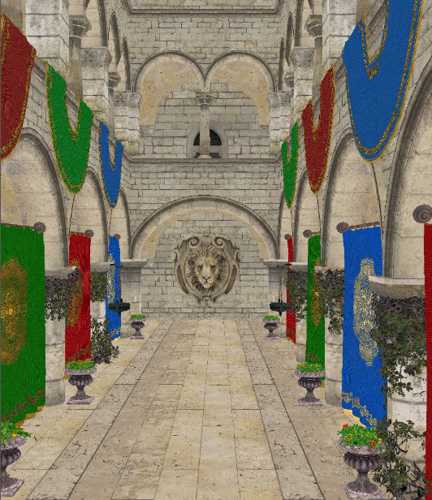

WebGL Forward+ and Clustered Deferred Shading
======================

**University of Pennsylvania, CIS 565: GPU Programming and Architecture, Project 4**

* Avi Serebrenik
* Tested on: **Google Chrome 141.0** on
  Windows 11, i7-13620H @ 2.4GHz 32GB, RTX 4070 8GB (Laptop)

### Live Demo

[GitHub Pages Link](https://ser-avi.github.io/Project4-WebGPU-Forward-Plus-and-Clustered-Deferred/)

### Demo Video/GIF

### Overview
This project showcases different algorithms for computing radial lights in a scene, running fully in the browser by using WebGPU and WGSL.
In the web app, users can fly through the Sponza scene in real time, while colorful lights float around.
The number of lights and the algorithm used can be adjusted in the top right.
The algorithms are the following:
 * **Naive:** In this purely naive algorithm, we use forward rendering with a basic vertex shader, and in the fragment shader, we check the light contribution against every light in the scene. This is incredibly wasteful, as most lights won't affect a given fragment.
 * **Forward+:** This algorithm has a compute shader step added before rendering, where we divide the scene viewed from the camera into "clusters" - aka bounding boxes - and store the indices of lights that could contribute to each cluster. Technically, this is a clustered algorithm and not the basic Forward+, since I cut clusters via the z-axis as well. To optimize, these z-slices are not linear in difference but logarithmic. Next, in the fragment shader, we first check which cluster we're in, and then only check against the lights that we assigned to this cluster. This has an added precomputation time, but it pays off by the massive speedup in the fragment shader, as we'll see in the analysis below. The biggest drawback, in my opinion, is the complexity of the setup, where we need to do a lot of coordinate transformations that get hard to keep track of, especially since we need to do it both in the compute shader and in the fragment shader.
 * **Clustered Deferred:** This is a deferred rendering method, where, after the same compute shader step as above, we do a G-Buffer pass, storing visible scene information into textures, and then only checking against those in a second pass. The second pass is a full-screen renderer where, in the vertex shader, I created a screen-spanning triangle, and then, in the fragment shader, I just used pixel position to sample the G-Buffer textures. This part turned out to be decently simpler than the Forward+ method, but the difficulty came from proper pipeline setup, since this was my first WGSL project. However, one can learn a lot about the api by setting this up.

The resulting textures from the deferred renderer are:
<table align="center">
  <tr>
    <td align="center">
      
       
      <em>Albedo</em>
    </td>
    <td align="center">
      
       
      <em>Normals (converted to [0,1] range)</em>
    </td>
        <td align="center">
      
       
      <em>Position</em>
    </td>
        </td>
        <td align="center">
      
       
      <em>Final resulting canvas</em>
    </td>
  </tr>
</table>

### Analysis
To analyze performance, I created three different scenarios. One, the "base settings," which is what I found to be the most reasonable during my setup. Next, one where I double the number of clusters in each dimension, and finally, one where I double the maximum number of lights I allow to be stored in each cluster. These of course change the buffer size as well, which I have noted in the table. The numbers are the following:
| Configuration | ClusterCountX | ClusterCountY | ClusterCountZ | MaxLightsPerCluster | Resulting Buffer Size (bytes) | Resulting Buffer Size (MB) |
| :--- | :--- | :--- | :--- | :--- | :--- | :--- |
| Base Settings | 16 | 8 | 32 | 1024 | 26,500,000 | ~25.27 |
| Half Size | 8 | 4 | 16 | 1024 | 11,600,000 | ~11.06 |
| 2x Lights | 16 | 8 | 32 | 2048 | 43,000,000 | ~41.02 |

To measure the results, I used the fps counter in the browser, but this is quite lacking, and I wish there was a better method, mainly because it was hard-capped at 70 by my browser for some reason. I tried using the WebGPU Debugger, but the fps count in that jumped around a lot and was also similarly capped. Also, it was capped at 160 a day ago, but it turned to 70 now, and I have no clue why... Anyway, here are my results:

Here I combined all the results, since they follow the same general trend. Naive is colored in blues, Forward+ in greens, and Deferred in reds. Base is set with circles, half size with triangles, and 2x lights with squares.
The results are pretty much what we would expect, except we can't really discern the difference between Forward+ and Deferred for most scenarios due to the cap. However, we can easily see how naive follows the logarithmic curve we were expecting, since it is O(fragments*lights). Of course, changing cluster numbers doesn't affect naive, since it is independent of it, but doubling the lights halves the performance.
For Forward+, we can see how doubling the number of lights slows us down, but not by that much, because the compute shader does the brunt of the work, and since we shouldn't really have over 1024 lights in a single cluster, the fragment shader should run at about the same speed. However, cutting the number of clusters in half in each dimension does reduce the performance quite considerably, since this drastically increases the number of lights in each cluster. Thus, even though our compute shader is faster here since we have fewer clusters, the fragment shader is significantly slower.
Finally, for Deferred, we can only really conclude that it is very fast. Definitely fast enough for real-time rendering for a scene like this. The only time it dips below the cap is at 5000 lights at the halved number of clusters in each dimension, which makes sense, since this was also the worst performance for Forward+.

Additionally, I should mention that the drawback of the deferred rendering pipeline is the extra memory overhead. When using the WebGPU Debugger, I found that the texture size went from 111 million bytes to 135 million when using the deferred method. This is about a 23 megabyte increase, which would be quite minimal offline, but I think it is significant on the web. Thus, this should be considered when deciding which method to use for a scene.

### Credits

- [Vite](https://vitejs.dev/)
- [loaders.gl](https://loaders.gl/)
- [dat.GUI](https://github.com/dataarts/dat.gui)
- [stats.js](https://github.com/mrdoob/stats.js)
- [wgpu-matrix](https://github.com/greggman/wgpu-matrix)
